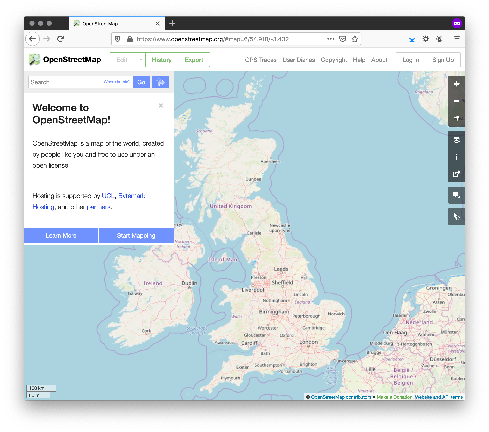

% Web Mapping & Analysis
% The Web's Architecture and Economy
%[Dani Arribas-Bel](http://darribas.org)

# Today

- A (brief an opinionated) history of the Web
- The server/client model
- The modern web mapping eco-system

#
## A (brief and opinionated) history of Web trends

## Pre 70s

The seeds:

- US (e.g. Licklider's "Galactic Network")
- Mostly military contracts (e.g. D/ARPA --> ARPANET) and "research'y"
- Develop protocols for machine communication

## 70s - Birth of the _internet_

[`[Source]`](https://commons.wikimedia.org/wiki/File:Arpanet_1972_Map.png)

## 80s

- Growth of the "web"
- From experimental validation to scaled up insfrastructure
- Free software (e.g. ["Free as in Freedom"](https://en.wikipedia.org/wiki/Free_as_in_Freedom))

## 90s

- Civilian and commercial growth
- Web 1.0
- Open Source software (e.g. ["The cathedral and the Bazaar"](https://en.wikipedia.org/wiki/The_Cathedral_and_the_Bazaar))

## 00s

- Web 2.0
- Mobile
- Web mapping takes off (hello Google Maps!)

## +10s

- Consolidation of [GAFA](https://en.wikipedia.org/wiki/Big_Four_tech_companies) --> concentration
- IoT
- Death of the desktop?

## Ideas to retain

- The Web is technology to build decentralised systems
- Economics (for the most part) have turned it into a concentrated economy
- Computing today is physically distributed but socio-economically concentrated

#
## The server/client model

## The server/client model

[`[Source]`](https://upload.wikimedia.org/wikipedia/commons/c/c9/Client-server-model.svg)

## Benefits

- Interoperability of disparate platforms
- Optimise on hard/software for each task ("distribute")
- Separate data collection (e.g. sensor), storage (e.g. data centre), intensive computing (e.g. compute cluster), interaction (e.g. mobile)

## "Disadvantages"

- Requires (cheap & ubiquitous) connectivity
- More complex than an isolated approach (e.g. desktop)
- Harder to "keep afloat"

## An example...

[`[Source]`](https://upload.wikimedia.org/wikipedia/commons/c/cf/Waymo_self-driving_car_front_view.gk.jpg)

## Another example...

## Contrast it with...

#
## The modern (web) mapping eco-system
## Building blocks of a web map

<table>
<col width="50%">
<col width="50%">
<tr>
    <td>
*Backend*
</td>
    <td>
*Frontend*
</td>
</tr>
<tr>
    <td>

</td>
    <td>

</td>
</tr>
<tr>
    <td>
Server
</td>
    <td>
Client
</td>
</tr>
<tr>
    <td>
Data, mapping (GIS)
</td>
    <td>
Style (CSS), web (HTML)
</td>
</tr>
</table>

## The current web mapping landscape

- `Software`: a _lot_ of open-source projects
- `Platforms`: a concentrated few (web infrastructure is hard and expensive!)
- `Business model`: software as a service

## The current web mapping landscape

**Trade-off** 

> convenience + agility
>
> 
Vs

>
> flexibility + ownership

`This course`: mostly rely on commercial platforms to focus on design and cartographic rather than engineering concepts

#
 Web Mapping & Analysis by <a xmlns:cc="http://creativecommons.org/ns#" href="http://darribas.org" property="cc:attributionName" rel="cc:attributionURL">Dani Arribas-Bel</a> is licensed under a <a rel="license" href="http://creativecommons.org/licenses/by-sa/4.0/">Creative Commons Attribution-ShareAlike 4.0 International License</a>.
