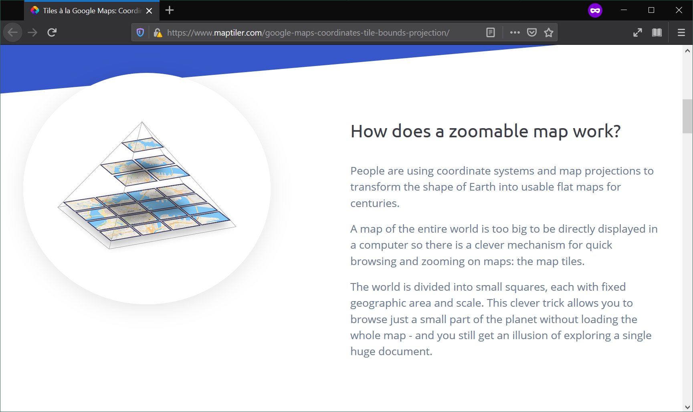

% Web Mapping & Analysis
% Data Backends I - Data Architecture & Formats
%[Dani Arribas-Bel](http://darribas.org)

# Today

- Spatial Data
- Spatial Data Formats
- Selecting the right format

#
## Spatial Data

## **Traditional** Spatial Data

In the "old days" only:

* Mapping agencies (e.g. OS)
* Administrative organizations (e.g. Land Registry)
* Military
* Large companies (e.g. Google)
* ...

could afford the generation of spatial dataset.

## **New** Spatial Data

Today, this list has **expanded** to essentially **anyone** with access to
(cheap) geospatial technology

## {data-background=../slides/figs/ride.jpg data-background-size=cover}

## {data-background=../slides/figs/osm.jpg data-background-size=cover}
[[Source]](http://openstreetmap.org)

## {data-background=../slides/figs/osm_lvl.jpg data-background-size=cover}
[[Source]](https://www.mapbox.com/gallery/#map-1)

## {data-background=../slides/figs/tweets.jpg}
[[Source]](https://api.tiles.mapbox.com/v4/enf.c3a2de35/page.html?access_token=pk.eyJ1IjoiZW5mIiwiYSI6IkNJek92bnMifQ.xn2_Uj9RkYTGRuCGg4DXZQ#11/51.5049/-0.1576)

## {data-background=../slides/figs/facebook.png data-background-size=contain}
[[Source]](https://code.facebook.com/posts/210838009040670/visualizing-friendships/)

## Data Models

*How* we represent the world in a computer

* Vector
* Raster

## Vector

Represent each entity with a shape or geometry. [Simple features](https://en.wikipedia.org/wiki/Simple_Features):

* (Multi-)Points
* (Multi-)Lines
* (Multi-)Polygons

Divide space into a **finite** set of entities

##

<iframe width="130%" height="620" frameborder="0" src='https://d9a.cartodb.com/viz/fe9751f0-6ced-11e4-98f3-0e9d821ea90d/embed_map'></iframe>

## {data-background=../slides/figs/lines.png data-background-size=cover}

[[Source]](http://www.dvrpc.org/webmaps/CyclePhilly/)

## {data-background=../slides/figs/polygons.png data-background-size=cover}

[[Source]](http://code.waag.org/buildings/#52.3733,4.8958,15)

## Raster

Use an **image** and control pixel colors to encode value

The value assigned for each cell represents the attribute of that cell

* **Continuous** variables, surfaces (temperature, density, elevation...)
* Satellite images (land cover, land use...)

## {data-background=../slides/figs/shaded.jpg data-background-size=contain}

[[Source]](http://shadedrelief.com/manual_relief/)

## {data-background=../slides/figs/cubesat.jpg data-background-size=contain}

[[Source]](https://upload.wikimedia.org/wikipedia/commons/0/05/CubeSat_in_hand.jpg)

## {data-background=../slides/figs/planet.png data-background-size=contain}
## {data-background=../slides/figs/strava_heatmap.png data-background-size=contain}

#
## Spatial Data Formats

## Spatial Data Formats

In principle...

- Points, lines, polygons --> Vector formats
- Images, surfaces --> Raster formats

But these boundaries are blur...

## {data-background=../slides/figs/ghsl.png data-background-size=contain}
## {data-background=../slides/figs/lucas.png data-background-size=contain}

## Traditionally

**`Vector`**

- Single files: shapefiles, etc.
- Client-server (geo-)DBs: PostGIS, etc.

**`Raster`**

- Mostly (single) image formats: GeoTIFF, etc.

## However...

Many of these formats were designed for an *offline* world, so display some of the following:

- Binary ("non-streamable")
- "Unqueriable"
- Complex format structures

## {data-background=../slides/figs/hate_shp.png data-background-size=contain}

## Modern formats

New formats have appeared in part *"fixing"* those issues, but also responding to web needs:

- Streamable (e.g. `GeoJSON`)
- Queriable (e.g. `PostGIS`/`Geopackage`)
- Single file (e.g. `.mbtiles`)

Let's explore a bit more on a couple of them...

## `GeoJSON`

## {data-background=../slides/figs/geojson.png data-background-size=contain}

## Advantages

- Plain text, (human) readable
- Streamable
- Well integrated with web standards (JSON)

Excellent exchange format

## Disadvantages

- Plain text, inefficient
- Non-queriable
- Vector only

## Tilesets (`.mb/vtiles`)

## {data-background=../slides/figs/mbtiles.png data-background-size=contain}

## Map Tiles

## {data-background=../slides/figs/map_tiles2.png data-background-size=contain}

## Advantages

- Queriable (SQLite)
- Fast access to large maps with limited resources (client/server model + queriable format)
- Some (vector tiles) are stylable

## Disadvantages

- Designed for _serving_ not _analysing_
- A dataset needs to be stored at several zoom levels
- Once created, hard to modify (e.g. reproject)

#
## Selecting the right format
## Selecting the right format

No silver bullet...

- _What_ type of data do you want to store? Vector, raster
- _What_ are you going to do with the file? Analysis, serving
- _What_ environment are you working? Locally, web

## Quiz

1. Large dataset of tweets you want to analyse `PostGIS/Geopackage`
1. Drone imagery to make available for workshop participants `MBTiles`
1. Street basemap to provide context to a small dataset you want to make available on the web `Vector tiles`
1. The small dataset from 3. `GeoJSON`

#
 Web Mapping & Analysis by <a xmlns:cc="http://creativecommons.org/ns#" href="http://darribas.org" property="cc:attributionName" rel="cc:attributionURL">Dani Arribas-Bel</a> is licensed under a <a rel="license" href="http://creativecommons.org/licenses/by-sa/4.0/">Creative Commons Attribution-ShareAlike 4.0 International License</a>.
