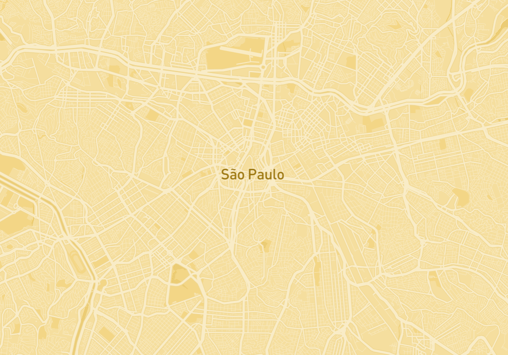
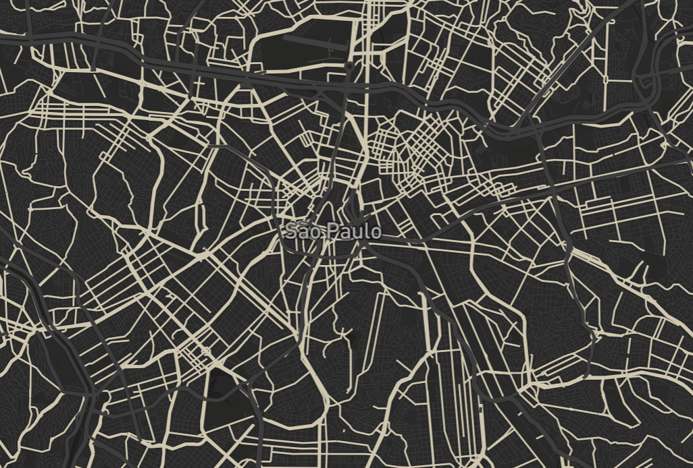
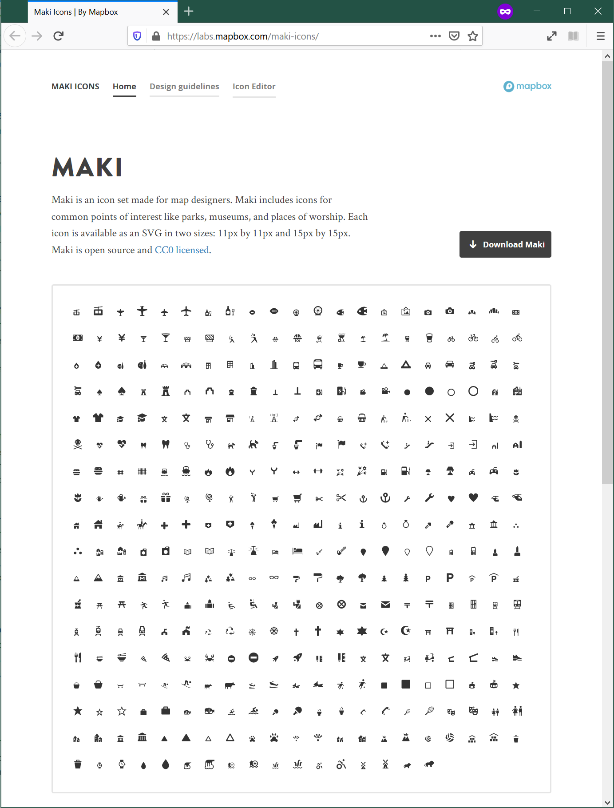
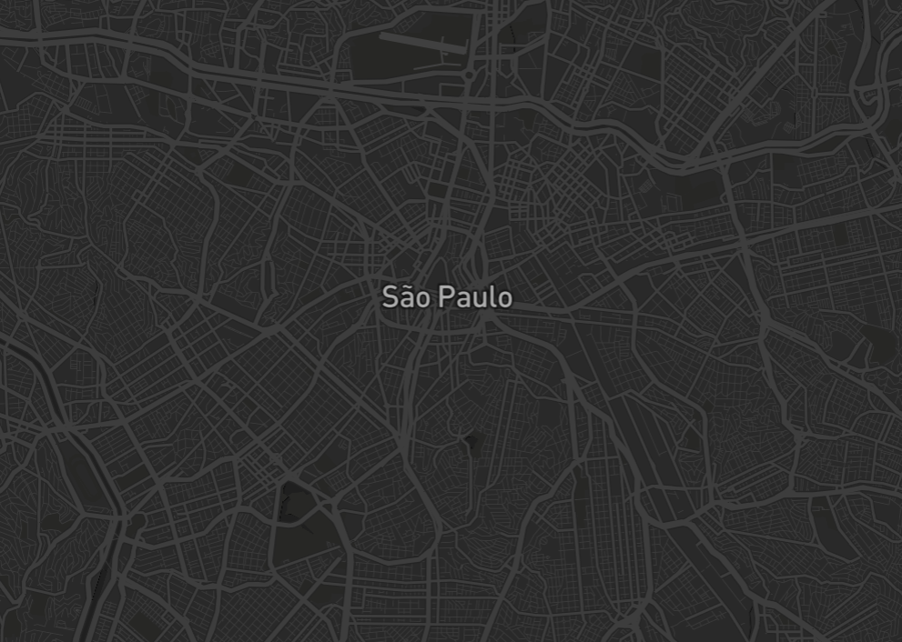
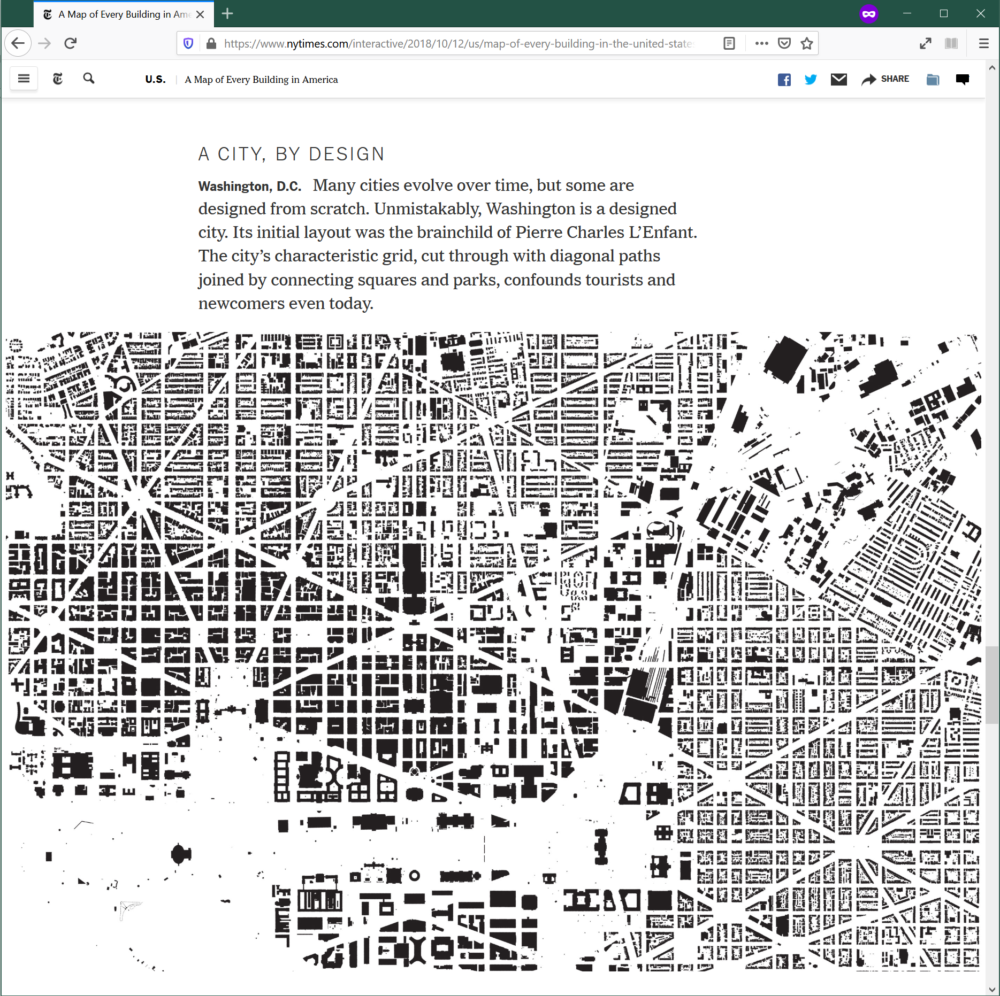
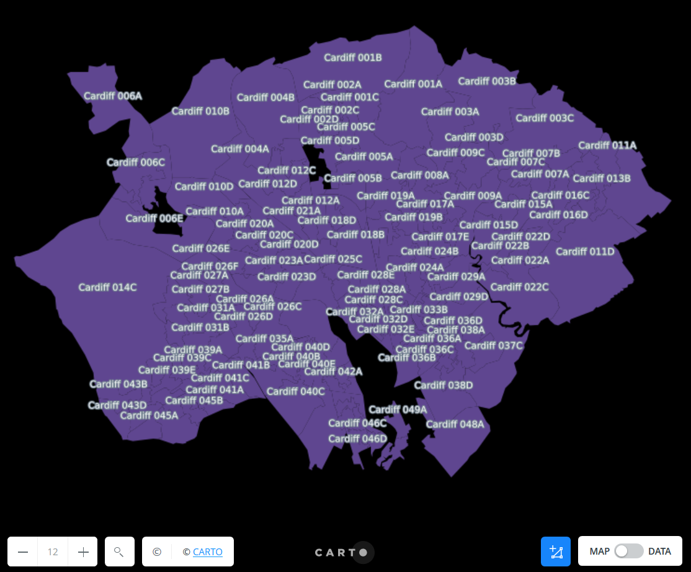

% Web Mapping & Analysis
% Map Design
%[Dani Arribas-Bel](http://darribas.org)

# Today

- Designing maps
- Design Elements
- Design Principles

# {data-background=../slides/figs/mb_guide.png data-background-size=contain}

<LEFT>
Mapbox 

Guide to Map Design

[`https://www.mapbox.com/designers/`](https://www.mapbox.com/designers/)
</LEFT>

#
## Designing Maps

## *What* is design?

> *"To plan in the mind, intend"*

<SMALL>
    [Oxford English Dictionary](https://www.oed.com/view/Entry/50841)
</SMALL>

## *Why* is design relevant?

- Explicitly consider the purpose of your map
- Encode your goals in the final product
- Influence decisions along the map making process

## *How* to think about design?

- Elements: building blocks
- Principles: how to combine them 

#
## Design Elements

## Color

<table>
<col width="70%">
<col width="30%">
<tr>
<td class='aligncenter' style="vertical-align:middle;">

- Grab attention 
- Encoding similarity, meaning
- Aesthetics, brand, tone, etc.

</td>
<td class='aligncenter'>
    

    
    
    

    
</td>
</tr>
</table>

## Texture

<table>
<col width="70%">
<col width="30%">
<tr>
<td class='aligncenter' style="vertical-align:middle;">

- *"Perceived surface"*
- Contributes to look and feel, but can also encode information (e.g. rugosity)
- Like color, without color

</td>
<td class='aligncenter'>

    <SMALL>
    [`URL`: Nat. Geo.](https://www.nationalgeographic.com/news/2016/09/mountain-elevation-maps-illustration/)
    </SMALL>
</td>
</tr>
</table>

## Labelling/typography

<table>
<col width="70%">
<col width="30%">
<tr>
<td class='aligncenter' style="vertical-align:middle;">

- Signal locations
- Keep readability in mind
- Typography communicates character, tone, style, etc.

    <SMALL>
    [Sources: [Helvetica](https://upload.wikimedia.org/wikipedia/commons/2/28/HelveticaSpecimenCH.svg),
    [Palatino](https://upload.wikimedia.org/wikipedia/commons/1/1a/Palatino_font_sample.svg)]
    </SMALL>
   
</td>
<td class='aligncenter'>
 
    
 
</td>
</tr>
</table>

## Iconography/markers

<table>
<col width="70%">
<col width="30%">
<tr>
<td class='aligncenter' style="vertical-align:middle;">

- Mark a location
- Encode category, etc.
- Aesthetics

</td>
<td class='aligncenter'>

    <SMALL>
    [`URL`: Mapbox](https://labs.mapbox.com/maki-icons/)
    </SMALL>
</td>
</tr>
</table>

#
## Design Principles

## Contrast

<table>
<col width="30%">
<col width="70%">
<tr>
<td class='aligncenter'>
    
    

 
    
 
    

</td>
<td class='aligncenter' style="vertical-align:middle;">

- Wired to the human brain
- Focus attention to areas of interest
- May hinder readability

</td>
</tr>
</table>

## Visual Hierarchy

- Priority order
- Foreground Vs Background
- How much each aspect is "abstracted"

## Visual Hierarchy: *Content*
<table>
<col width="30%">
<col width="70%">
<tr>
<td class='aligncenter'>
    

    
</td>
<td class='aligncenter' style="vertical-align:middle;">

- Do not clutter
- Keep in mind cognitive load of each element
- Align with the core message
    
</td>
</tr>
</table>

## Visual Hierarchy: *Context*

<table>
<col width="30%">
<col width="70%">
<tr>
<td class='aligncenter'>
    
    

 
    
 
    

</td>
<td class='aligncenter' style="vertical-align:middle;">

- Provide the "right" background
- Ensure it does not have protagonism
- Include *only* if it helps read the content better

</td>
</tr>
</table>

## Density

<table>
<col width="30%">
<col width="70%">
<tr>
<td class='aligncenter'>
    
    

 
    
 
    

</td>
<td class='aligncenter' style="vertical-align:middle;">

- Information Vs Clutter
- Think of the purpose and audience
- Consider: placement, size, readbility

</td>
</tr>
</table>

## Legibility

*Is the message you try to get across getting across?*

- Context-dependent
- Combination of iconography, typography, proximity of features, etc.

#
## Other considerations

## Projections

<table>
<col width="30%">
<col width="70%">
<tr>
<td class='aligncenter'>
   
 
    
</td>
<td class='aligncenter' style="vertical-align:middle;">

*How do you want to be wrong about the Earth?*
    
<SMALL>
Source: [XKCD](https://www.xkcd.com/977/) 
</SMALL>

</td>
</tr>
</table>

## Legend & other elements

*Do you really need it?*

- Auxilliary elements: legend, North arrow, scale...
- May improve legibility, but also clutter
- Sometimes, it is required (e.g. scientific publications)

#
 Web Mapping & Analysis by <a xmlns:cc="http://creativecommons.org/ns#" href="http://darribas.org" property="cc:attributionName" rel="cc:attributionURL">Dani Arribas-Bel</a> is licensed under a <a rel="license" href="http://creativecommons.org/licenses/by-sa/4.0/">Creative Commons Attribution-ShareAlike 4.0 International License</a>.

