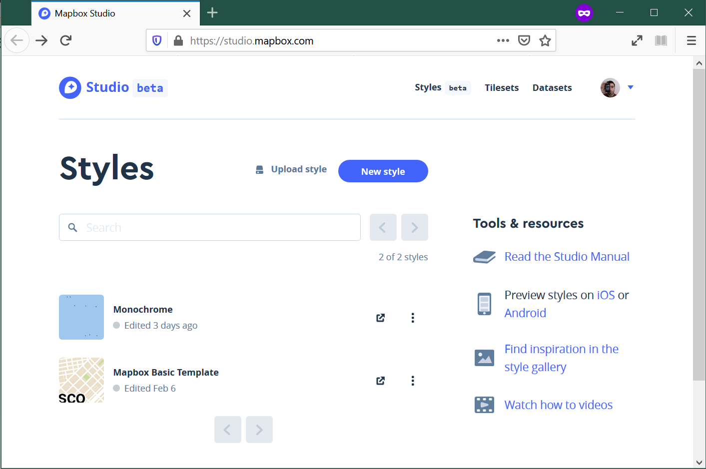
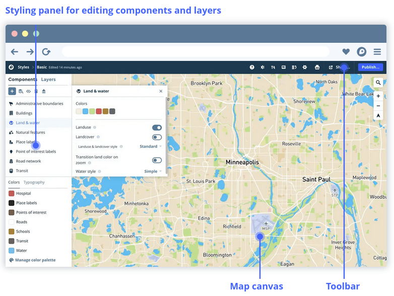

# Lab 6 - Map Design

In this lab, we will put to use some of the ideas and concepts we have learnt about map design. We will do so using [Mapbox Studio](https://www.mapbox.com/mapbox-studio/), a tool that will allow us to control almost any thinkable aspect of a map.

As we go through the practicalities, remember the concepts that inspire map design, which we have outlined in the [lecture slides](../slidedecks/lecture_06.html). The challenge here is not in learning the software, but in being able to translate abstract notions of design into an applied context.

To complete this lab, you will require the following:

- The internet
- An active Mapbox account

## Mapbox Studio

Let's get starting by logging into our Mapbox account and opening up the Studio at:

> [`https://studio.mapbox.com/`](https://studio.mapbox.com/)

You should see something like this:

To explore what is possible, we will create a new style. Click on the "New Style" button and pick the "Monochrome" option. Select the color you prefer. This will load the Studio editor, where we will spend most of this session.

The Studio is structured around three main panels: styling on the left, the map canvas, and the toolbar at the top.

[`Source`: Mapbox](https://docs.mapbox.com/studio-manual/reference/styles/#style-editor)

Most of the time, we will select views, layers, and data from the styling panel, and our actions will drive changes on the map canvas. In this tutorial, we will examine how to modify and style the different elements of design we have seen in class:

- Color
- Texture
- Labelling and typography
- Iconography

We will finish our tour discussing the Elements feature and learning about how to add our own data to the maps we style in Studio.

## Exercise

For this exercise, we will be using the "CLIWOC Slim and Routes" data product:

> [`https://figshare.com/articles/CLIWOC_Slim_and_Routes/11941224`](https://figshare.com/articles/CLIWOC_Slim_and_Routes/11941224)

Team in groups of two to four and pick one of the following options:

1. Global map of trade routes
2. Map of ship activity around South Africa 
3. Map showing how important the island of Saint Helena was in this period
4. Map of shipping activity in the English Channel
5. Map of expeditions into the Arctic
6. Map of activity around the Caribbean

Style a map according to its goal.

## Presentation

Once you are happy with your final style, publish it and drop the link on the module's Team. Designate one member of the group to present it. The presentation should cover the following:

- What is the map about?
- What design elements did you tweak? How? Why?
- What choices did you make following design principles? What other alternatives did you consider? Why did you opt for those choices?
