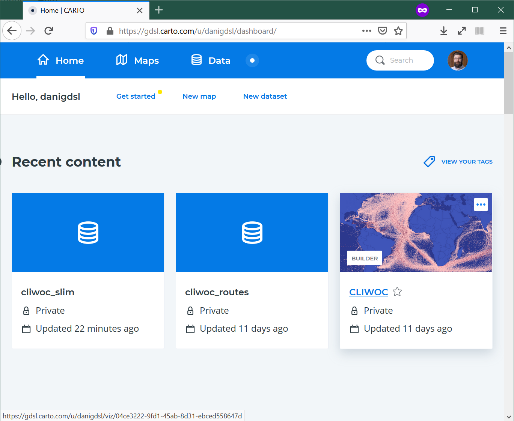
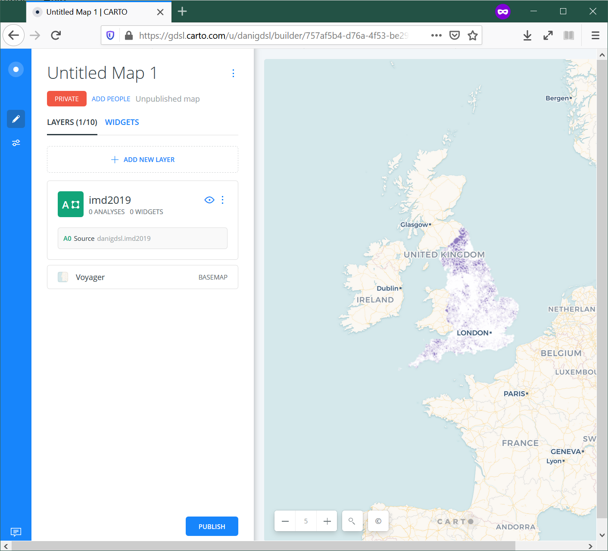

# Lab 7 - Interactivity

In this lab, we are going to get our hands dirty and play with different elements that allow us to make a map interactive. We will do so using [CARTO](https://carto.com/), which makes possible (and even fun!) to work interactivity into a map in different ways.

As we go through the hands-on aspect of this block, please keep the [lecture slides](../slidedecks/lecture_07.html) handy and revisit them as much as you need to. As always, the real challenge is not to learn how to use a piece of software, but how to apply conceptual notions in a practical context.

To complete this lab, you will require the following:

- The internet
- An active CARTO account

## CARTO

We will use CARTO to quickly be able to make web maps and explore how you can build interactivity in web maps.

Let us start by logging into CARTO:

> [`carto.com`](https://carto.com)

Upon login, you should see a dashboard that looks more or less like:

To see the main features, you can create a "New Map" (either from the dasboard or the "Maps" section, you will be able to find that button), and add the `imd2019` dataset we used for [Lab 6](../labs/lab_06.html) (remember, you will find it on the "Shared with you" tab). This will take you to a new page that looks roughly like:

Now let's remember the building blocks of interactivity we have learnt in the [lecture](../slidedecks/lecture_07.html):

- Filtering
    - **Pan**
    - **Zoom**
    - **Subset**
- Perspective
- Volume
- **Tooltips**
- Split
- **Animate**

In bold those that we will work through in this lab.

To demonstrate animations, we will use another dataset we have enountered in the past, the CLIWOC ship logs:

> [`https://figshare.com/articles/CLIWOC_Slim_and_Routes/11941224`](https://figshare.com/articles/CLIWOC_Slim_and_Routes/11941224)

You should be able to find it also on your "Shared with you" section of the Data tab. We will work with individual logs (`cliwoc_slim`) to create an animation of the logs, for example grouping them by month, as in this example of expeditions into the North:

## Exercise

Now we know the mechanics of interactivity in CARTO, let's show off! Pick whichever you want first, and have a go at the following maps:

1. An animation of global trade over time
1. A map that lets you pick a given country and display its main routes
1. A map that lets you identify the vesel ID (`id`), date, and country of ships around Cape Town
1. A choropleth where you can select routes by their length in days
1. An animation of each route in the region around Jakarta
1. A map that allows you to select a single route, zoom into its origin, and then pan throughout the route

Once completed, select the one you like best, and post it on Teams.

## Presentation

You will then have 30 seconds to present your favorite map and hit the following points:

- What the map shows
- What interactivity element(s) you have used
- One thing you think is really effective about it

Remember, 30 seconds. Short and sweet. Make them count!
